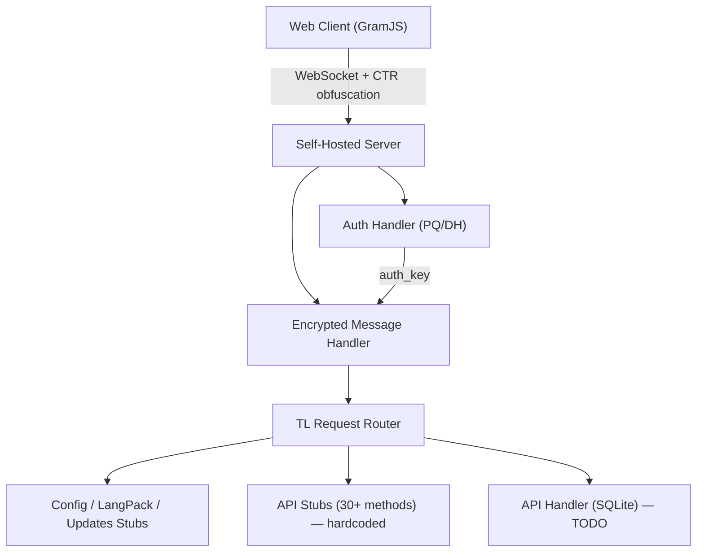

# Telegram Web Client → Self-Hosted MTProto Backend

## Обзор

Полная автономия GramJS-based Web клиента от инфраструктуры Telegram. Клиент подключается к self-hosted Node.js серверу по протоколу MTProto 2.0, проходит полный handshake, получает Config и рендерит основной UI.

---

## ✅ Что сделано

### 1. Obfuscated Transport (WebSocket + AES-256-CTR)

Клиент отправляет 64-байтный obfuscation header при подключении. Сервер:
- Парсит header, извлекает CTR-ключи для encrypt/decrypt
- Проверяет tag `0xefefefef` (TCPAbridged)
- Устанавливает двусторонний CTR-стрим для всего последующего трафика

> [!IMPORTANT]
> Файл: [server.ts](file:///Users/sckr.a/telegram_reverse/self_hosted_version/src/mtproto/server.ts) — `processBuffer()`

---

### 2. MTProto Handshake (auth_key generation)

Полная реализация DH-обмена:

```
Client                         Server
  │── ReqPqMulti ──────────────▶│  0xbe7e8ef1
  │◀──────────────── ResPQ ─────│  PQ + server_nonce + fingerprint
  │── ReqDHParams ─────────────▶│  0xd712e4be (RSA-encrypted p_q_inner_data)
  │◀──── ServerDHParamsOk ──────│  0xd0e8075c (AES-IGE encrypted DH params)
  │── SetClientDHParams ───────▶│  0xf5045f1f (g_b encrypted)
  │◀──────── DhGenOk ──────────│  0x3bcbf734 (auth_key established!)
```

Ключевые файлы:
- [auth.ts](file:///Users/sckr.a/telegram_reverse/self_hosted_version/src/mtproto/auth.ts) — `processReqPqMultiSync()`, `processReqDHParamsSync()`, `processSetClientDHParamsSync()`
- [RSA.ts](file:///Users/sckr.a/telegram_reverse/web_client/src/lib/gramjs/crypto/RSA.ts) — клиентский RSA с нашим ключом

> [!NOTE]
> RSA ключ сервера синхронизирован: fingerprint и modulus в `RSA.ts` соответствуют серверному приватному ключу.

---

### 3. IGE Encryption Compatibility Fix (Critical Bug)

**Проблема:** Библиотека `@cryptography/aes` (используемая GramJS) имеет **перевёрнутый порядок IV-половинок** по сравнению со стандартной IGE реализацией.

| Операция | Standard IGE | @cryptography/aes |
|----------|-------------|-------------------|
| Encrypt x_prev | `iv[0:16]` | `iv[16:32]` |
| Encrypt y_prev | `iv[16:32]` | `iv[0:16]` |
| Decrypt y_prev | `iv[0:16]` | `iv[16:32]` |
| Decrypt x_prev | `iv[16:32]` | `iv[0:16]` |

**Решение:** Серверная IGE ([utils.ts](file:///Users/sckr.a/telegram_reverse/self_hosted_version/src/crypto/utils.ts)) переделана для совместимости — IV-половинки swapped.

> [!CAUTION]
> Это критическое изменение. Без него весь DH-обмен и encrypted messaging не работают. Подтверждено unit-тестом: `serverEncryptIge → clientDecryptIge = Match: true`.

---

### 4. Encrypted Message Handling (MTProto 2.0)

После установки auth_key, клиент отправляет encrypted messages:

```
auth_key_id (8 bytes) ≠ 0 → encrypted message
├── msg_key (16 bytes) → derives AES key/iv
└── encrypted_data → AES-IGE decrypt → inner message
```

**Key derivation (MTProto 2.0 spec):**
- Client→Server (x=0): `auth_key[0:36]`, `auth_key[40:76]`
- Server→Client (x=8): `auth_key[8:44]`, `auth_key[48:84]`
- msg_key computation: `SHA256(auth_key[88+x : 120+x] + plaintext)[8:24]`

> [!IMPORTANT]
> Файл: [server.ts](file:///Users/sckr.a/telegram_reverse/self_hosted_version/src/mtproto/server.ts) — `handleEncryptedMessage()`, `createEncryptedResponse()`

---

### 5. TL Response Serialization

Реализованы binary TL-ответы (не JSON!) для ключевых методов:

| Метод | Constructor ID | Response |
|-------|---------------|----------|
| `help.getConfig` | `0xc4f9186b` | `config#cc1a241e` |
| `help.getAppConfig` | `0x61003e28` / `0x61e3f854` | `help.appConfig#dd18782e` |
| `updates.getState` | `0xedd4882a` | `updates.state#a56c2a3e` |
| `updates.getDifference` | `0x19c2f763` | `updates.differenceEmpty#5d75a138` |
| `langpack.getLangPack` | `0xf2f2330a` | `langPackDifference#f385c1f6` |
| `langpack.getStrings` | `0xefea3803` | empty vector |
| `langpack.getLanguage` | `0x6a596502` | `langPackLanguage#eeca5ce3` |
| `langpack.getDifference` | `0xcd984aa5` | `langPackDifference#f385c1f6` |
| `ping_delay_disconnect` | `0xf3427b8c` | `pong#347773c5` |
| `msg_container` | `0x73f1f8dc` | Unwrap + process each |
| `msgs_ack` | `0x62d6b459` | Ignore (no response) |
| `invokeWithLayer` | `0xda9b0d0d` | Unwrap inner |
| `initConnection` | `0xc1cd5ea9` | Unwrap inner |
| `invokeAfterMsg` | `0xcb9f372d` | Unwrap inner |

---

### 6. Codec & Serialization Fixes

- `BinaryWriter.writeInt()`: переключен на `writeUInt32LE(value >>> 0)` для поддержки unsigned constructor IDs > 0x7FFFFFFF
- `writeTlString()`: proper TL string serialization с padding до 4 bytes

---

## 📊 Текущий статус клиента

```
✅ MTProto handshake          → auth_key established
✅ Encrypted messaging        → bidirectional AES-IGE
✅ Config loaded              → connectionStateReady
✅ LangPack loaded            → UI strings
✅ Ping/Pong                  → persistent connection
✅ authorizationStateReady    → main UI renders
✅ Main bundle loaded         → RENDER MAIN
✅ Sync started               → messages.GetDialogs invoked
```

---

### 7. API Stubs для основного UI (Приоритет 1) ✅

После загрузки Main bundle клиент вызывает десятки API-методов для рендера интерфейса. Без ответов UI остаётся пустым.

**Подход:** Hardcoded TL-binary stubs прямо в `server.ts`. Это сознательное решение — позволяет быстро пройти весь boot-sequence клиента. Будет рефакторено на SQLite-backed handlers при реализации messaging (Приоритет 4).

**Seed User:** При первом вызове `users.getFullUser(InputUserSelf)` сервер создаёт hardcoded пользователя:
- `id = 100000`, `access_hash = 0x1234567890ABCDEF`
- `first_name = "User"`, `phone = "+10000000000"`
- `status = userStatusOnline`

#### Реализованные методы:

| Constructor | Метод | Response |
|------------|-------|----------|
| `0x6628562c` | `users.getFullUser` | `users.userFull#3b6d152e` + seed user |
| `0x0d91a548` | `users.getUsers` | Vector\<User\> (seed user) |
| `0xb60f5918` | `messages.getDialogFilters` | `messages.dialogFilters#d95ef153` (empty) |
| `0xefd48c89` | `messages.getDialogs` | `messages.dialogs#15ba6c40` (empty) |
| `0x735787a8` | `messages.getPeerDialogs` | `messages.peerDialogs#3407e51b` (empty) |
| `0xe04232f3` | `messages.getPinnedDialogs` | `messages.peerDialogs#3407e51b` (empty) |
| `0x1fb33026` | `help.getNearestDc` | `nearestDc#8e1a1775` |
| `0xa0f4cb4f` | `account.updateStatus` | `boolTrue#997275b5` |
| `0x5dd69e12` | `contacts.getContacts` | `contacts.contacts#eae87e42` (empty) |
| `0xb288bc7d` | `messages.getDialogUnreadMarks` | empty vector |
| `0xa622aa10` | `account.getNotifySettings` | `peerNotifySettings#99622c0c` |
| `0x9b9240a6` | `help.getPromoData` | `help.promoDataEmpty#98f6ac75` |
| `0xe470bcfd` | `account.getWallPapers` | `account.wallPapersNotModified#1c199183` |
| `0x150b3b4c` | `messages.getStickerSet` | `stickerSetNotModified#d3f924eb` |
| `0x72d4742c` | `help.getAppChangelog` | `updates#74ae4240` (empty) |
| `0xb7e085fe` | `auth.exportLoginToken` | `auth.loginToken#629f1980` |
| `0x9e36afb8` | `contacts.getTopPeers` | `topPeersDisabled#b52c939d` |
| `0xdda8cce0` | `contacts.getBlocked` | `contacts.blocked#0ade1591` (empty) |
| `0x2c6f97b7` | `messages.getAvailableReactions` | `availableReactionsNotModified` |
| `0x4dbe8` | `account.getGlobalPrivacySettings` | `globalPrivacySettings#734c4ccb` |
| `0xc33ce680` | `messages.getAttachMenuBots` | `attachMenuBotsNotModified` |
| `0xdadbc950` | `account.getPassword` | `account.password#957b50fb` (no password) |
| `0x9f07c728` | `messages.getAllStickers` | `allStickersNotModified` |
| `0xd29a27f4` | `messages.getFeaturedStickers` | `featuredStickersNotModified` |
| `0x5b118126` | `messages.getRecentStickers` | `recentStickersNotModified` |
| `0xf107e790` | `messages.getSavedGifs` | `savedGifsNotModified` |
| `0x57f17692` | `messages.getFavedStickers` | `favedStickersNotModified` |
| `0x4b550e5a` | `messages.getDefaultHistoryTTL` | `defaultHistoryTTL#43b46b20` |
| `0x871c6e82` | `account.getContentSettings` | `contentSettings#57e28221` |

> [!NOTE]
> Все ответы — TL-binary (не JSON!). Добавлены helper-функции `writeTlBytes()` для сериализации bytes-полей и `writeUser()` для переиспользования user-сериализации.

> [!IMPORTANT]
> Constructor ID `0xd45ab096` оказался коллизией — это `passwordKdfAlgoUnknown`, а не `contacts.getContacts` (правильный ID: `0x5dd69e12`). Коллизия исправлена.

---

## 📊 Текущий статус клиента

```
✅ MTProto handshake          → auth_key established
✅ Encrypted messaging        → bidirectional AES-IGE
✅ Config loaded              → connectionStateReady
✅ LangPack loaded            → UI strings
✅ Ping/Pong                  → persistent connection
✅ authorizationStateReady    → main UI renders
✅ Main bundle loaded         → RENDER MAIN
✅ Sync started               → updates.getState / getDifference
✅ Seed user loaded           → users.getFullUser(InputUserSelf)
✅ Empty dialogs              → messages.getDialogs
✅ UI bootstrap complete      → all secondary stubs respond
✅ No TL decode errors        → no TypeNotFoundError / unhandled TL
✅ Localhost client cleanup   → no websync CSP noise, no SW warning
```

### Валидация от 2026-04-08

Последний end-to-end прогон на `ws://localhost:8080` + `http://localhost:1234` подтверждает, что клиент проходит весь текущий bootstrap без TL-ошибок:

- Main UI рендерится стабильно
- `updates.getState`, `users.getFullUser`, `messages.getDialogs`, `messages.getPinnedDialogs`, `messages.getSavedDialogs`, `stories.getAllStories` и весь observed secondary batch успешно парсятся клиентом
- `websync` отключён для `localhost`, поэтому больше нет CSP-шумов от `t.me/_websync_`
- Service Worker отключается на `localhost`, чтобы dev-сборка не показывала ложный `ServiceWorker not available`
- `handleError` сделан устойчивым к пустым `unhandledrejection`, поэтому исчезло `handleError.ts:40 undefined`

> [!NOTE]
> Пустой основной экран на этом этапе — ожидаемое поведение, а не regression. Сервер намеренно возвращает empty dialogs / contacts / saved dialogs. Следующий функциональный шаг — не "чинить bootstrap", а наполнять backend реальными данными (`messages.getDialogs`, `messages.getHistory`, `messages.sendMessage`, updates push).

> [!NOTE]
> В server log всё ещё наблюдаются вторичное подключение без `auth_key` и повторяющиеся ответы с одинаковым `seqNo=148`. Пока это не ломает клиентский bootstrap и не проявляется как ошибка в UI, поэтому оставлено как follow-up, а не blocker.

---

## 🔧 Что предстоит

### Приоритет 2: Auth Flow (регистрация/логин)

- `auth.sendCode` → отправка SMS кода (или фейковый code для dev)
- `auth.signIn` → вход по коду
- `auth.signUp` → регистрация
- Генерация и хранение `user_id` в SQLite
- Логика: при отсутствии session → показывать auth screen, при наличии → auto-login

### Приоритет 3: Persistent Sessions

- Сохранение `auth_key` в SQLite (сейчас хранится в памяти, теряется при рестарте сервера)
- Клиент пытается переподключиться с кешированным `auth_key_id`, но сервер его не помнит → forced re-handshake

### Приоритет 4: Messaging

- `messages.sendMessage` → отправка сообщений (SQLite-backed)
- `messages.getHistory` → история сообщений
- `messages.getDialogs` → реальный список диалогов из БД
- `updates` push → real-time уведомления через WebSocket

### Приоритет 5: Multi-User Communication

- Маршрутизация сообщений между сессиями
- Online/offline статусы
- Typing indicators (`messages.setTyping`)
- Read receipts (`messages.readHistory`)

### Приоритет 6: Decoupling Cleanup

- Убрать debug логи из auth.ts и Authenticator.ts
- `websync` уже отключён для `localhost` dev-run; позже решить production/local стратегию окончательно
- Service Worker уже отключён для `localhost` dev-run; позже вернуть его для production-only режима
- Заменить все hardcoded ссылки на Telegram в UI

---

## 📁 Ключевые файлы

### Server
| Файл | Описание |
|------|----------|
| [server.ts](file:///Users/sckr.a/telegram_reverse/self_hosted_version/src/mtproto/server.ts) | WebSocket transport, message routing, encrypted msg handling, bootstrap TL stubs for Main UI |
| [auth.ts](file:///Users/sckr.a/telegram_reverse/self_hosted_version/src/mtproto/auth.ts) | MTProto handshake (PQ/DH/auth_key) |
| [codec.ts](file:///Users/sckr.a/telegram_reverse/self_hosted_version/src/mtproto/codec.ts) | BinaryReader/Writer for TL serialization |
| [utils.ts](file:///Users/sckr.a/telegram_reverse/self_hosted_version/src/crypto/utils.ts) | IGE, CTR, SHA, RSA crypto primitives |

### Client (modified)
| Файл | Описание |
|------|----------|
| [RSA.ts](file:///Users/sckr.a/telegram_reverse/web_client/src/lib/gramjs/crypto/RSA.ts) | Custom server RSA key |
| [Authenticator.ts](file:///Users/sckr.a/telegram_reverse/web_client/src/lib/gramjs/network/Authenticator.ts) | Debug logging for key derivation |
| [websync.ts](file:///Users/sckr.a/telegram_reverse/web_client/src/util/websync.ts) | Localhost bypass for external websync scripts, no CSP noise in dev |
| [setupServiceWorker.ts](file:///Users/sckr.a/telegram_reverse/web_client/src/util/setupServiceWorker.ts) | Disable Service Worker on localhost dev-run |
| [handleError.ts](file:///Users/sckr.a/telegram_reverse/web_client/src/util/handleError.ts) | Safe handling for empty `unhandledrejection` payloads |

---

## 🏗️ Архитектура


